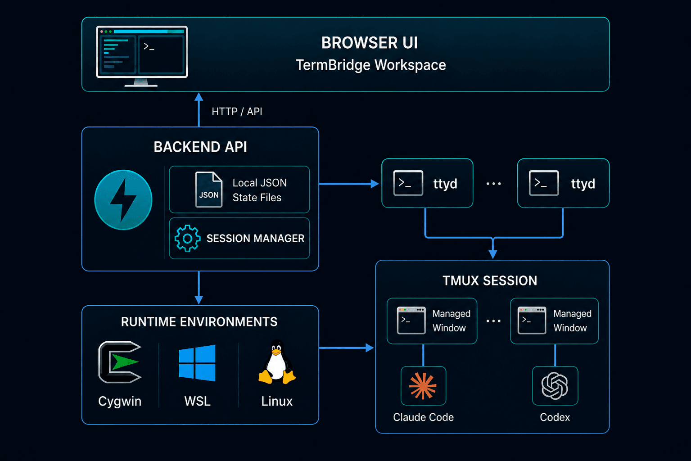

# TermBridge

[English](README.md)

TermBridge 是一个本地浏览器工作台，用于通过 `ttyd` 管理由 `tmux` 持久化的终端会话。

它面向经常同时打开多个本地 shell、agent CLI 和项目目录的开发者。你可以创建可复用的快捷方式，在指定工作目录中启动它们，通过浏览器连接终端，并借助 `tmux` 回到仍在运行的工作上下文，而不是在大量终端窗口里寻找。

> [!IMPORTANT]
> TermBridge 当前版本**还没有内置**认证、授权、HTTPS、多用户隔离或托管部署加固。本地开发建议绑定到 `127.0.0.1`。如果通过公网、移动端、tunnel 或反向代理访问，请在 TermBridge 外层配置合适的访问控制、TLS 和隔离措施。不要暴露未保护的实例。

## 为什么使用 TermBridge？

- 用浏览器 UI 管理本地终端工作区
- 通过 `tmux` 在刷新页面或重新连接后保留终端状态
- 通过 `ttyd` 在浏览器中连接终端
- 通过快捷方式启动 `bash`、`claude`、`codex` 或自定义命令
- 支持 Windows/Cygwin、Windows/WSL、Linux 的 readiness 运行环境模型
- 使用本地 JSON 文件保存状态，不需要数据库服务

## 架构



TermBridge 按运行环境和工作目录组织会话。内部实现上，一个工作区对应一个 `tmux` session，一个会话入口对应其中的一个托管 `tmux` window。

## 支持的运行环境

| 运行环境 | 状态 | 说明 |
| --- | --- | --- |
| Windows/Cygwin | 就绪后支持 | 使用 Windows 原生 `ttyd`、Cygwin bash 和 Cygwin `tmux`。 |
| Windows/WSL | 就绪后支持 | 使用 Windows 原生 `ttyd`，并通过 `wsl` 进入默认 WSL 环境。 |
| Linux | 还没有就绪 | Linux 主机支持仍在准备中。 |

所有运行环境初始都是 `not_ready`。请在环境页面检查依赖或保存必要路径。如果没有任何 ready 环境，TermBridge 会引导你去配置环境，而不是展示不可用的创建流程。

## 依赖要求

开发环境：

- Python 3.11+
- [uv](https://docs.astral.sh/uv/)
- Node.js 和 Yarn

运行时：

- [`ttyd`](https://github.com/tsl0922/ttyd)
- [`tmux`](https://github.com/tmux/tmux/wiki)
- Cygwin、WSL 或 Linux shell 环境

## 从源码快速开始

安装依赖：

```bash
make install
```

启动后端 API：

```bash
make backend
```

在另一个终端启动前端开发服务器：

```bash
make frontend
```

后端默认运行在 `127.0.0.1:9008`。前端运行在 `127.0.0.1:9007`，并将 `/api` 和 `/health` 代理到后端。

在浏览器打开前端，进入环境页面，对你要使用的运行环境执行检查。

## 安装后使用

安装 Python 包后，可以这样启动服务：

```bash
termbridge --host 127.0.0.1 --port 9008
```


## 配置

TermBridge 从带有 `TERMBRIDGE_` 前缀的环境变量和 `.env` 文件读取配置。

请查看 [.env.sample](.env.sample) 了解可用配置项和本地开发示例。

## 快捷方式

快捷方式是可复用的命令入口。文档示例使用普通命令，例如 `bash`、`claude` 和 `codex`。

使用前请检查并按需编辑快捷方式命令。快捷方式命令会在本机的目标运行环境中执行，因此应将快捷方式配置视为受信的本地代码执行入口。

## Docker

本地构建并运行：

```bash
docker build -t termbridge:local .
docker run --rm -p 9008:9008 termbridge:local
```


容器会由后端提供构建后的前端资源。真实终端会话仍需要 `ttyd`、`tmux`、Cygwin、WSL 或 Linux shell 环境可用并正确配置。

不要在未添加认证、HTTPS 和隔离措施的情况下，把该容器发布到不受信网络。

## 开发

开发检查、打包命令、Pull Request 指南和仓库清理说明请查看 [CONTRIBUTING.md](CONTRIBUTING.md)。

## 安全

请查看 [SECURITY.md](SECURITY.md) 了解当前安全边界和漏洞报告方式。

## 许可证

TermBridge 使用 [MIT License](LICENSE) 发布。
